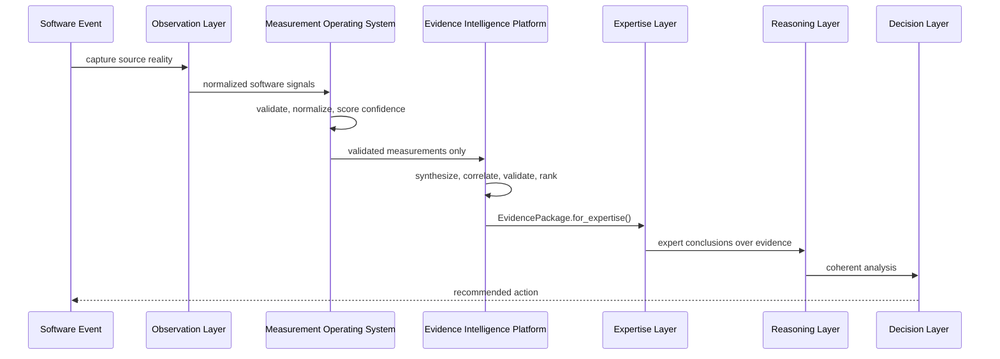

# PIA Architecture

## Canonical Pipeline

The platform architecture is now:

```text
Software Events
    |
    v
Observation Layer
    |
    v
Measurement Operating System
    |
    v
Evidence Intelligence Platform
    |
    v
Expertise Layer
    |
    v
Reasoning Layer
    |
    v
Decision Layer
```

Conceptually:

```text
Event -> Measurement -> Evidence -> Expertise -> Reasoning -> Decision
```

## Layer Responsibilities

- Events capture reality.
- Observations preserve source-system facts in normalized software signals.
- Measurements quantify reality with deterministic, validated, unit-aware
  values.
- Evidence synthesizes and validates conclusions from measurements.
- Expertise applies domain knowledge and best practices to evidence.
- Reasoning combines expert knowledge into coherent analyses.
- Decisions recommend actions based on reasoning.

## Evidence Boundary

The Evidence Intelligence Platform is the exclusive bridge between the
Measurement Operating System and the Expertise Layer.

The Expertise Layer must never directly consume measurements. It receives only
validated `Evidence` objects from an `EvidencePackage`.

The Evidence layer must never calculate measurements. It consumes only
Measurement Layer outputs that have passed validation or warning gates, then
discovers, validates, correlates, ranks, and explains evidence.

## High-Level Sequence



## Package Map

```text
backend/app/measurement
  deterministic measurement operating system

backend/app/evidence
  production-grade evidence intelligence platform

backend/app/expertise_mapping, backend/app/estimator
  expertise derivation from evidence and historical knowledge

backend/app/agent
  reasoning and user-facing analysis orchestration

backend/app/decision, backend/app/executive
  decision recommendations and planning
```

## Backward Compatibility

Earlier milestones used `domain.Evidence` for event-derived interpretation.
That object remains for legacy flows. M35 introduces
`app.evidence.domain.Evidence` as the production evidence object used between
Measurement and Expertise.
