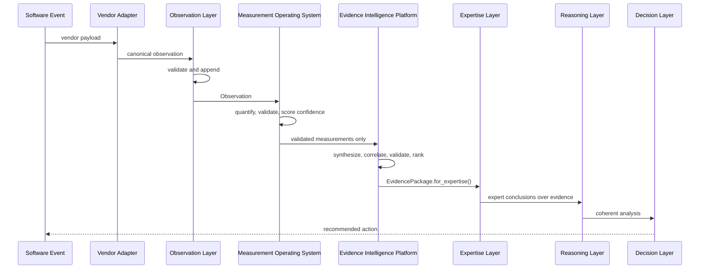

# PIA Architecture

## Canonical Pipeline

The platform architecture is now:

```text
Software Events
    |
    v
Vendor Adapter
    |
    v
Observation Layer
    |
    v
Measurement Operating System
    |
    v
Evidence Intelligence Platform
    |
    v
Expertise Layer
    |
    v
Reasoning Layer
    |
    v
Decision Layer
```

Conceptually:

```text
Observation -> Measurement -> Evidence -> Expertise -> Reasoning -> Decision
```

## Layer Responsibilities

- Vendor adapters fetch platform data and translate it into observations.
- Observation preserves immutable, vendor-neutral canonical facts.
- Measurement quantifies reality with deterministic, validated, unit-aware
  values.
- Evidence synthesizes and validates conclusions from measurements.
- Expertise applies domain knowledge and best practices to evidence.
- Reasoning combines expert knowledge into coherent analyses.
- Decisions recommend actions based on reasoning.

Observation does not calculate measurements, infer evidence, estimate
confidence, assign risk, normalize business meaning, or reason.

## Evidence Boundary

The Evidence Intelligence Platform is the exclusive bridge between the
Measurement Operating System and the Expertise Layer.

The Expertise Layer must never directly consume observations or measurements.
It receives only validated `Evidence` objects from an `EvidencePackage`.

The Evidence layer must never calculate measurements. It consumes only
Measurement Layer outputs that have passed validation or warning gates, then
discovers, validates, correlates, ranks, and explains evidence.

## High-Level Sequence



## Package Map

```text
backend/app/observation
  canonical observation platform, registry, ontology, validation and store

backend/app/measurement
  deterministic measurement operating system

backend/app/evidence
  production-grade evidence intelligence platform

backend/app/expertise_mapping, backend/app/estimator
  expertise derivation from evidence and historical knowledge

backend/app/agent
  reasoning and user-facing analysis orchestration

backend/app/decision, backend/app/executive
  decision recommendations and planning
```

## Backward Compatibility

Earlier milestones used `domain.Event` as the primary source abstraction. That
object remains for legacy flows only. M36 introduces
`app.observation.domain.Observation` as the production object consumed by the
Measurement Operating System.
